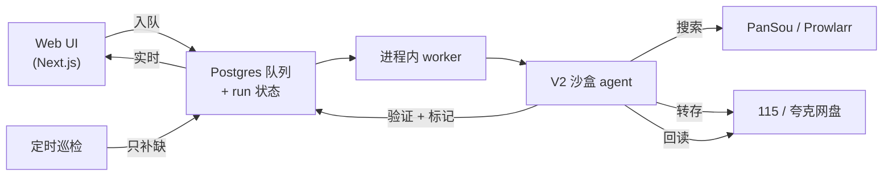

# Mediary Scout

**给你自己网盘用的 agent 驱动媒体库。** 你说要某部电影/剧/番,LLM agent 跨索引源搜罗资源、把最合适的转存进你自己的 115 / 夸克网盘、转存后回读验证,并持续追踪还缺什么。

[](LICENSE) · [English](README.md)


> **免责声明。** Mediary Scout 是**开源、自部署**软件,**不提供、也永远不会提供托管服务** —— 你自己跑实例、自带网盘 / LLM / 元数据凭证。它做的就是你本可以在自己网盘里手动完成的那些文件操作。项目定位详见 [docs/distribution-and-legal-positioning.md](docs/distribution-and-legal-positioning.md)。

## 它是什么

大多数「媒体自动化」要么搜得好但不知道你到底缺哪集,要么会搬文件却从不验证落了什么。Mediary Scout 把获取当成一个**状态问题**,由一个「凭证据而非凭感觉」行动的 agent 驱动:

- **多盘、品牌可扩展** —— 现支持 115 与夸克,每块盘都是一等工作区(树模型:一个账号、多块盘)。接入新网盘品牌是个收敛的插件活。
- **agent 选片** —— agent 读真实搜索结果,按画质偏好、**中文字幕**需求、去重来挑,转存后再回读验证。
- **追踪 + 定时补缺** —— 季级状态机;定时巡检只回来处理仍有缺集的剧。
- **网盘原生** —— 直接把分享/磁力**转存**(秒传 / save)进你的网盘,不往本地磁盘下载。

面向熟悉自己网盘账号与凭证的进阶自部署用户 —— 不是一键式消费产品。

## 功能

| | |
|---|---|
| **搜索 → 获取** —— 找到目标、点「获取」,agent 接管 |  |
| **媒体库墙** —— 按盘看你有什么,带缺集 / 追更徽章 |  |
| **剧详情** —— 各季覆盖、缺口、追踪状态 |  |
| **实时活动** —— 工作时的实时队列 + agent 动作 ticker |  |
| **通知** —— 单部获取 + 每日巡检摘要,多渠道推送 |  |
| **设置** —— 网盘、画质、语言、LLM(自带 key)、Prowlarr、PanSou |  |

多块盘以工作区切换器呈现,带各自品牌图标:


## 架构

web 端入队,常驻 worker 驱动一个沙盒 agent:agent 拥有窄而受审计的权限,所有副作用由确定性 workflow 拥有,并回读真实状态做验证。



- 状态全程落 **Postgres**,所以 run 可在 worker 重启后续跑(agent 从真实网盘 + DB 状态重建,不依赖缓存的对话历史)。
- 元数据来自 **TMDB**(内置代理兜底,开箱即用);资源搜索来自 **PanSou**,可选 **Prowlarr**(磁力/种子索引器)。

## 快速开始

最快是 Docker Compose(web + Postgres + 自带 PanSou):

```bash
cp .env.example .env   # 可选——大多数配置可在 UI 里填
docker compose up -d
```

打开 web UI,在**设置**里按需提供(全部自带):

- **网盘** —— 连 115 或夸克(扫码登录,或粘贴 cookie)。
- **TMDB** —— 经代理开箱即用;想直连可填自己的 key。
- **LLM** —— 任意 OpenAI 兼容端点(`baseURL` / `apiKey` / `modelId`)。作者看不到你的 key。
- **Prowlarr**(可选) —— 加你的索引器以获得磁力/种子源(仅 115;夸克无磁力 API)。

完整自部署说明:[docs/deploy-compose.md](docs/deploy-compose.md)。

## 支持的网盘

- **115**(`pan115`) —— 完整支持,含经 Prowlarr 的磁力。
- **夸克**(`quark`) —— 分享链转存(无磁力 web API)。

新品牌接入一个 storage-brand 注册表;大头是为该网盘的转存 API 写一个 cookie 客户端 + 一个 storage executor。

## 状态与限制

- 自部署、面向进阶用户;需要可用的 115/夸克(有会员最实用)。
- 定时巡检在常开的主机上价值最大。
- 这不是托管产品,不附带任何托管后端。

## 致谢与上游

构建于以下项目之上,并致谢:

- [PanSou](https://github.com/fish2018/pansou-web) —— 资源搜索后端
- [Prowlarr](https://github.com/Prowlarr/Prowlarr) —— 索引器管理(可选)
- [p115client](https://github.com/ChenyangGao/p115client) —— 115 API 参考
- [TMDB](https://www.themoviedb.org/) —— 元数据(本产品未获 TMDB 认证或背书)

与 115、夸克、TMDB 及任何索引器均无隶属关系。Mediary Scout 是围绕这些组件构建的、克制的独立工作流。
